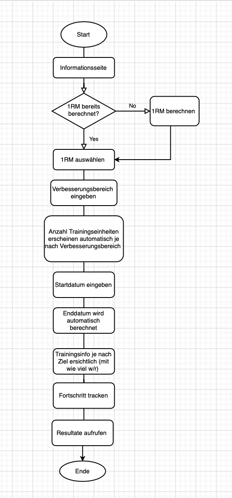
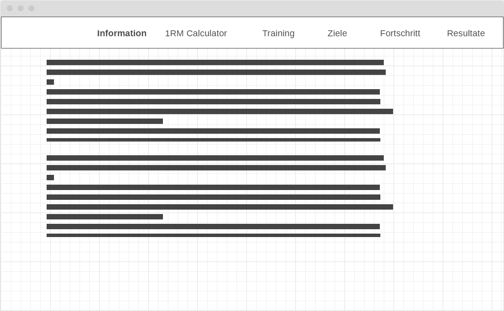
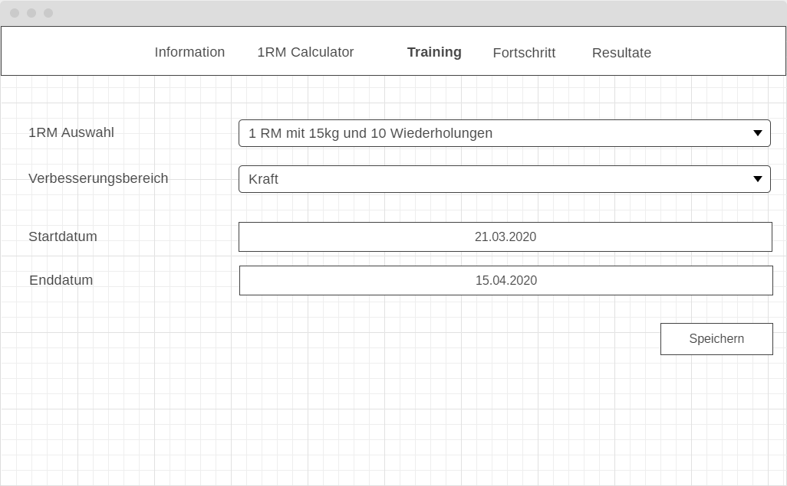
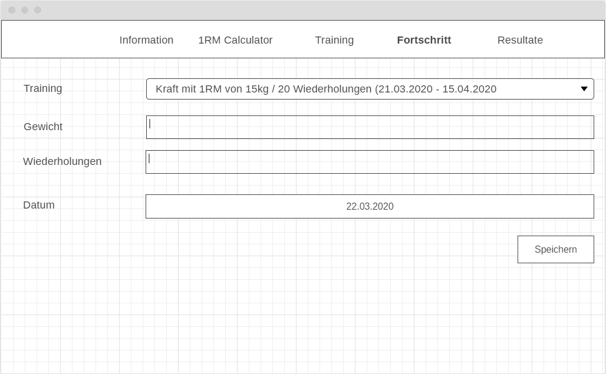
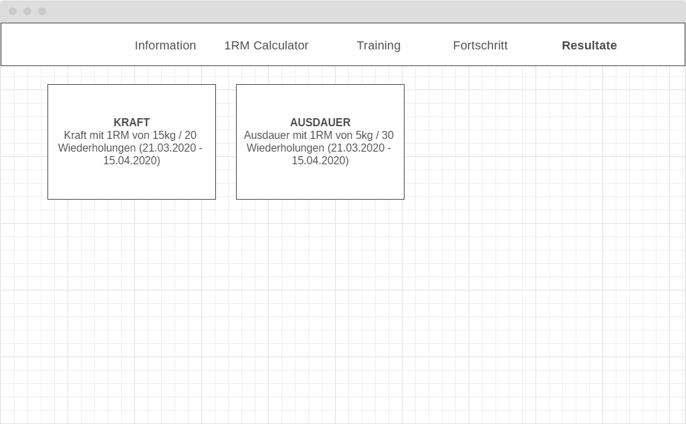
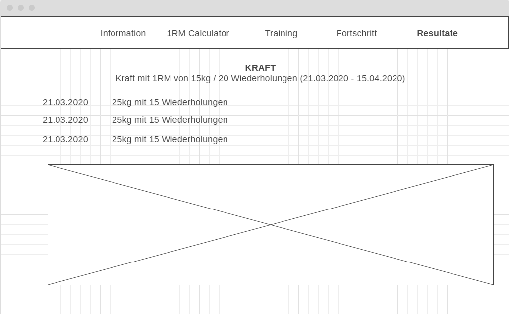
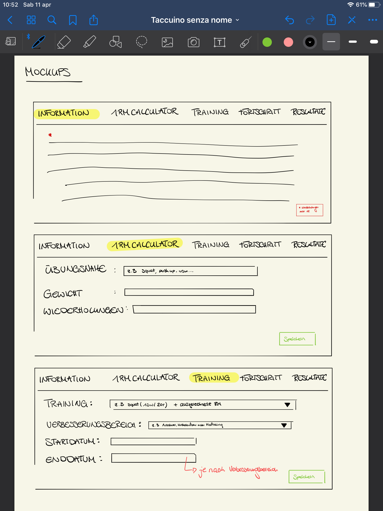
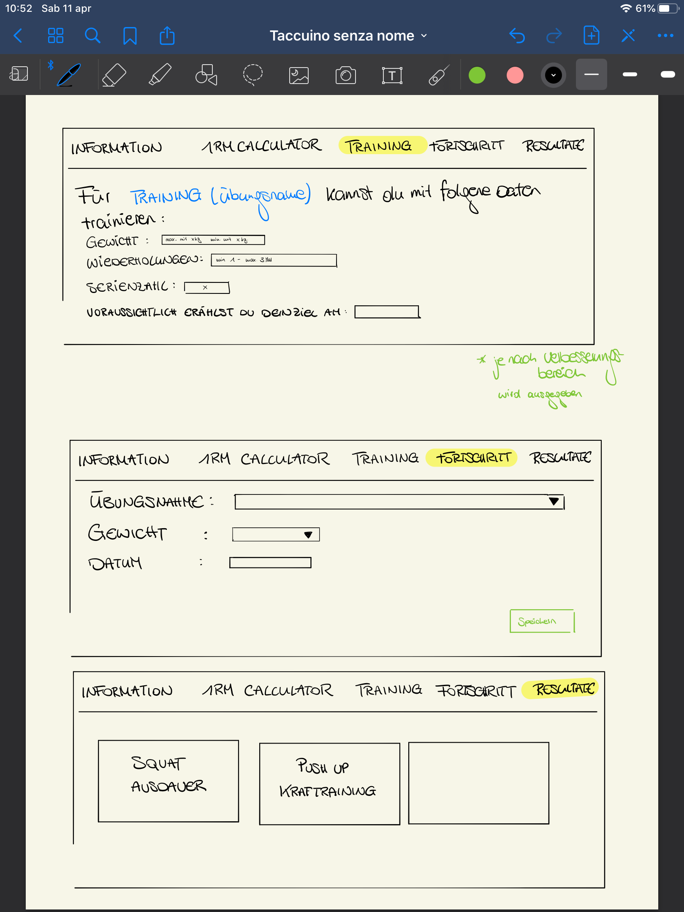
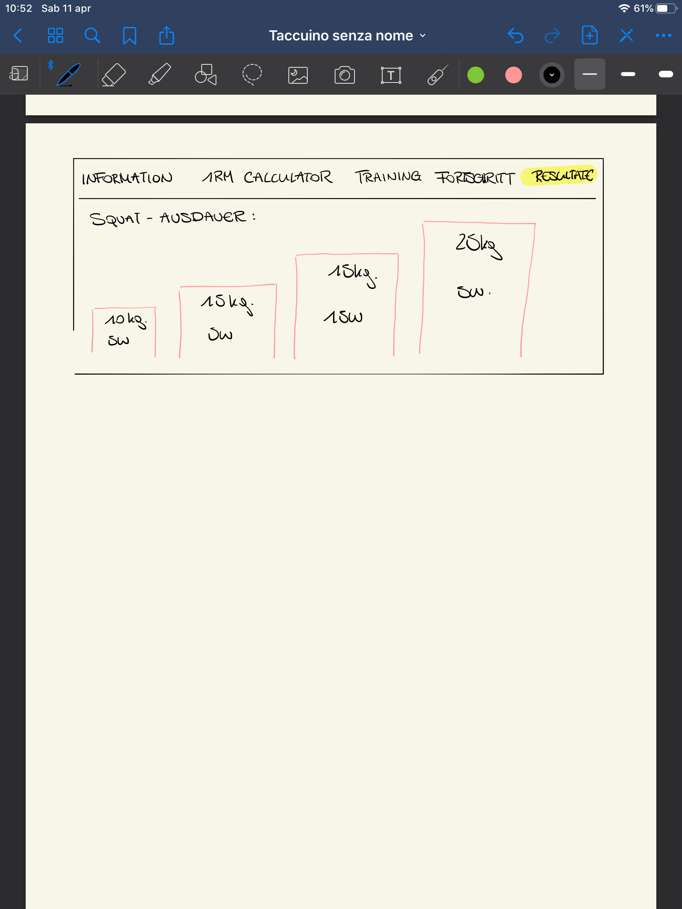

# Projektidee Webapplikation
## Ausgangslage:
Sicherlich hast du schon ein Krafttraining Video angeschaut – vllt. mit Gewichten. Der Typ kann 20 Sätze machen und du bist nach 10 Wiederholungen schon ohne Kraft? Das liegt daran, dass ihr nicht die gleichen Kräfte haben oder dass er wahrscheinlich bereits trainiert hat und das Video seine ersten Trainings nicht gepostet hat ;) 
Deshalb wird sich diese Anwendung als nützlich erweisen. Diese benutzerdefinierte Anwendung wird das Maximum einer Wiederholung beim Krafttraining – 1RM (maximale Gewichtsmenge) berechnen. 

## Funktion/Projektidee: 
Diese Webapplikation wird für Menschen, die seine maximale Stärke kennenlernen wollen erstellt. Nicht jeder weiss, wie viel Gewicht er beim Training heben kann. Durch die Berechnung deiner Maximalkraft wirst du den Effekt deines Trainings verbessern und kannst das gewünschte Ziel in kurzer Zeit erreichen. Die App ist in der Lage, das Idealgewicht zu finden, um den Körper nicht zu viel belasten aber gleichzeitig keine Wiederholungen zu machen, ohne dass man Ergebnisse erzielt. Die Wiederholungsmaximum kann als Obergrenze verwendet werden, um die gewünschte Belastung für eine Übung zu bestimmen. 

## Workflow
Zu Beginn der Projektentwicklung wurde das Ablaufdiagramm erstellt.


### Dateneingabe
Um deine maximale Stärke zu berechnen, musst du einige persönlichen Daten in die Anwendung eingeben, wie z.B das Gewicht, dass du gehoben hast und die entsprechenden Wiederholungen. Gib dein Ziel ein, das du erreichen möchtest. Da die App individuell angepasst ist, kannst du auch deine persönlichen Daten eingeben und für jeden Erfolg, den du erzielst, erhältst du einfache Benachrichtigung und du kannst auf die nächste Stufe fortsetzen. 
		 
### Datenverarbeitung/Speicherung 

#### 1RM Calculator
```json
[
	{
		"gewicht": 25.5,
		"wiederholungen": 10
	},
	{
		"gewicht": 50,
		"wiederholungen": 5
	}
]
```

#### Training
```json
[
	{
		"1rm": {
			"gewicht": 25.5,
			"wiederholungen": 10
		},
		"bereich": "kraft",
		"anzahlTrainingsEinheiten": 5,
		"startDatum": "21.03.2020",
		"endDatum": "21.03.2020",
		"berechnung": {
			"gewicht": 20,
			"wiederholungen": 8
		},
		"fortschritt": ["22.03.2020", "23.03.2020", "25.03.2020"]
	},
	{
		"1rm": {
			"gewicht": 15,
			"wiederholungen": 20
		},
		"bereich": "ausdauer",
		"anzahlTrainingsEinheiten": 10,
		"startDatum": "21.03.2020",
		"endDatum": "21.03.2020",
		"berechnung": {
			"gewicht": 13,
			"wiederholungen": 15
		},
		"fortschritt": ["22.03.2020", "23.03.2020", "25.03.2020"]
		
	},
]
```

### Datenausgabe
Wenn du deine maximale Kraft berechnet hast, kannst du wissen, wie viel Gewicht und wie viele Wiederholungen du trainierst kannst, um deine gewünschtes Ziel zu erreichen. 

## Mockups










## Optionale Erweiterungen
Es könnte noch ein Archievment Bereich ergänzt werden. Zum Beispiel könnte das Archievment "Buff Dude" freigeschalten werden wenn 5 Trainingseinheiten im Bereich Kraft erfolgreich absolviert wurden

## Validierung
- [ ] Flussdiagramm
- [x]  1RM Calculator
  - [x] Es können nicht doppelte Einträge (gleiches Gewicht und  Wiederholungen vorhanden sein)
- [ ] Training
  - [x] Es kann nicht das genau gleiche Training nochmals erfasst werden
  - [ ] Enddatum kann nicht vor Startdatum liegen
  - [ ] Berechnungsmethoden (Prozentsatz)
- [ ] Fortschritt
  - [ ] HTML umsetzen 
  - [ ] Dropdown mit Daten befüllen 
  - [ ] abspeichern


